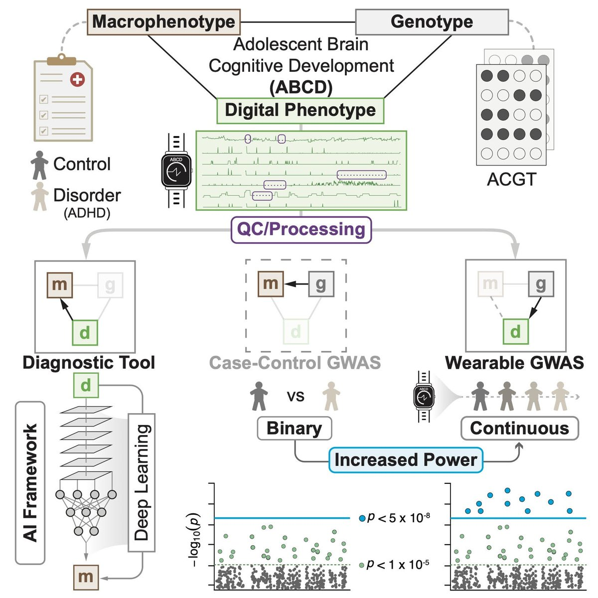
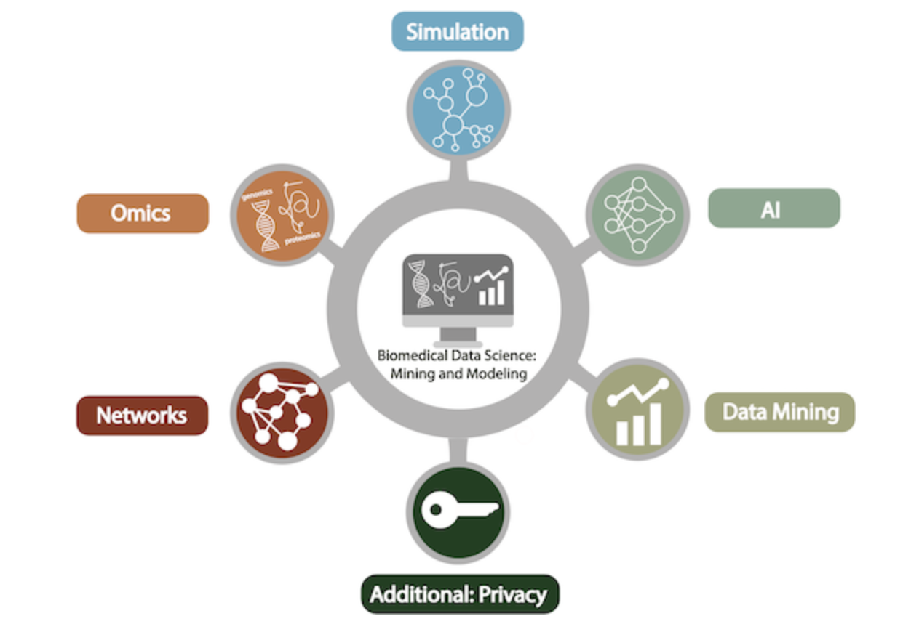

<!-- PROJECT SHIELDS -->
<!--
*** I'm using markdown "reference style" links for readability.
*** Reference links are enclosed in brackets [ ] instead of parentheses ( ).
*** See the bottom of this document for the declaration of the reference variables
*** for contributors-url, forks-url, etc. This is an optional, concise syntax you may use.
*** https://www.markdownguide.org/basic-syntax/#reference-style-links
-->

  
[![Members][Members-shield]][Members-url]
[![Forks][forks-shield]][forks-url]
[![Issues][issues-shield]][issues-url]
[![Lab Website][labweb-shield]][labweb-url]
[![Twitter][twitter-shield]][twitter-url]

<!-- PROJECT LOGO -->
 

  

  <h2 style="margin-top: 15px;">📢 Latest Research from Gerstein Lab</h2>
  
<em>Click on the image above to see our latest research update!</em>

  

    🚀 Welcome to the <strong>Gerstein Lab GitHub</strong>!  
  

  
  

<!-- TABLE OF CONTENTS -->

  
Table of Contents

  <ol>
    <li>
      <a href="#about-the-project">About The Lab</a>
      <ul>
        <li><a href="#repo-categories">Repo Categories</a></li>
      </ul>
    </li>
    <li><a href="#contributing">Contributing</a></li>
    <li><a href="#contact">Contact</a></li>
    <li><a href="#acknowledgments">Acknowledgments</a></li>
  </ol>

<!-- ABOUT THE PROJECT -->
## About The Lab

The Gerstein Lab bridges quantitative disciplines like computer science and statistics with molecular biology to tackle practical challenges and analyze large-scale biological data. Our work frequently involves collaboration within multi-disciplinary teams and participation in consortia such as PsychENCODE, ENCODE, GSP/CMG, and 1000 Genomes. Below, we outline key areas of our research, all contributing to our overarching mission of interpreting personal genomes and advancing the field of biomedical data science. See lab permissions and copyright statement [here](https://sites.gersteinlab.org/permissions/).

  

### Repo Categories

This section presents an organized overview of all our repositories.

<h4>Genome Annotation</h4>

  
  * 
    
  * 
    
  * 
    
  * 
    
  * 
    
  * 
  
  * 
    
  * 
    
  * 
    
  * 
    
  * 
    
  * 
    
  * 
    
  * 
    
  * 
    
  * 
    
  * 
    
  * 
    
  * 
    
  * 
    
  * 
  
  * 
    
  * 
    
  * 
    
  * 
    
  * 
    
  * 
    
  * 
    
  * 
    
  * 
    
  * 
    
  * 
    
  * 
    
  * 
    
  * 
    
  * 
    
  * 
    

  

  
<h4>Disease Genomics</h4>

  
  * 
  
  * 
    
  * 
    
  * 
    
  * 
    
  * 
    
  * 
    
  * 
    

  
<h4>Personal Genomics & Genomic Privacy</h4>

  
  * 
    
  * 
  
  * 
    
  * 
    
  * 
    
  * 
    
  * 
    
  * 
    
  * 
    
  * 
    
  * 
    
  * 
    

   
<h4>Data Science & Biological Networks</h4>

  
  * 
    
  * 
    
  * 
    
  * 
    
  * 
    

  
<h4>Molecular Motion & Structures</h4>

  
  * 
    
  * 
    
  * 
    
  * 
    
  * 
    
  * 
    
  * 
    
  * 
    
  * 
    
  * 
    

  
<h4>Interpretable Machine Learning Tools</h4>

  
  * 
  
  * 
    
  * 
    
  * 
    
  * 
    
  * 
    
  * 
    
  * 
  
  * 
    
  * 
  
  * 
    
   *  
  * 
    
  * 
    
  * 
    
  * 
  
  * 
    
  * 
    
  * 
  
  * 
  
  * 
    
  * 
    
  * 
    
  * 
    
  * 
    

  
<h4>Yale Class - Biomedical Data Science: Mining & Modeling</h4>

  
  
  
  * 
  * 
  * 
  * 
  * 
  * 

  

<!-- CONTRIBUTING -->
## Contributing

Contributions are what make the open source community such an amazing place to learn, inspire, and create. Any contributions you make are **greatly appreciated**.

If you have a suggestion that would make this better, please fork the repo and create a pull request. You can also simply open an issue with the tag "enhancement".
Don't forget to give the project a star! Thanks again!

1. Fork the Project
2. Create your Feature Branch (`git checkout -b feature/AmazingFeature`)
3. Commit your Changes (`git commit -m 'Add some AmazingFeature'`)
4. Push to the Branch (`git push origin feature/AmazingFeature`)
5. Open a Pull Request

  

<!-- CONTACT -->
## Contact

PI Email: [mark@GersteinLab.org](mark@GersteinLab.org) 

  

<!-- ACKNOWLEDGMENTS -->
## Acknowledgments

We sincerely thank our collaborators, alumni, and Yale University for their invaluable contributions and support. Special thanks to our funding sources whose generosity has been vital to our research in computational biology and biomedical data science. Your collective efforts inspire and sustain the Gerstein Lab’s mission—thank you! 

  

<!-- MARKDOWN LINKS & IMAGES -->
<!-- https://www.markdownguide.org/basic-syntax/#reference-style-links -->
[Members-shield]: https://img.shields.io/badge/-Members-black.svg?style=for-the-badge&logo=linkedin&colorB=555
[Members-url]: https://github.com/orgs/gersteinlab/people
[forks-shield]: https://img.shields.io/badge/-Forks-black.svg?style=for-the-badge&logo=linkedin&colorB=555
[forks-url]: https://github.com/search?q=user%3Agersteinlab+forks%3A%3E0&type=repositories&s=forks&o=desc
[issues-shield]: https://img.shields.io/badge/-Issues-black.svg?style=for-the-badge&logo=linkedin&colorB=555
[issues-url]: https://github.com/search?q=org%3Agersteinlab+issues&type=issues
[labweb-shield]: https://img.shields.io/badge/-Lab_Website-black.svg?style=for-the-badge&logo=linkedin&colorB=555
[labweb-url]: https://www.gersteinlab.org/
[twitter-shield]: https://img.shields.io/badge/-Twitter-black.svg?style=for-the-badge&logo=linkedin&colorB=555
[twitter-url]: https://x.com/GersteinLab

